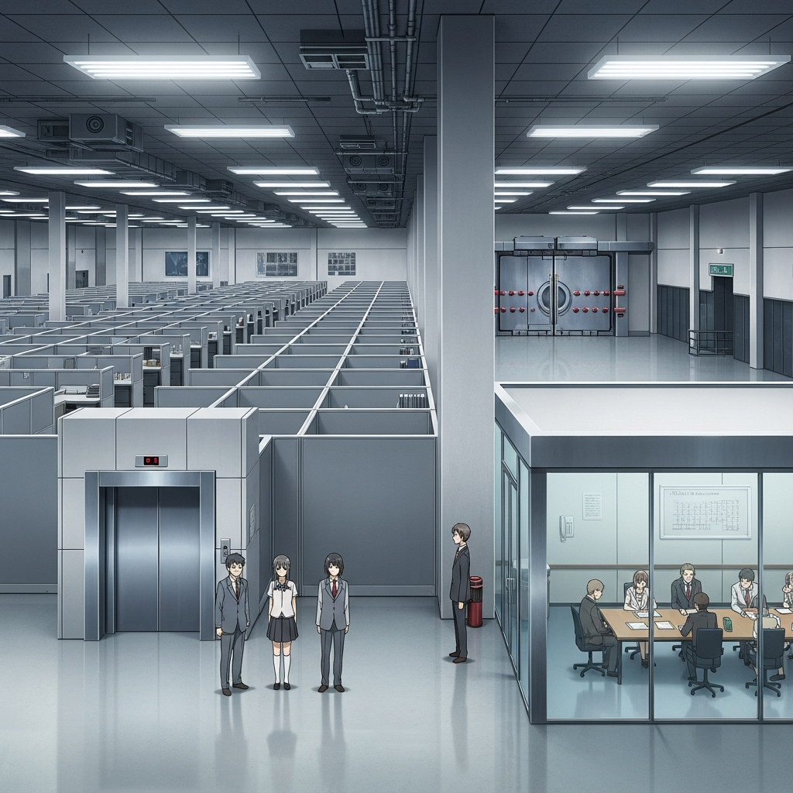
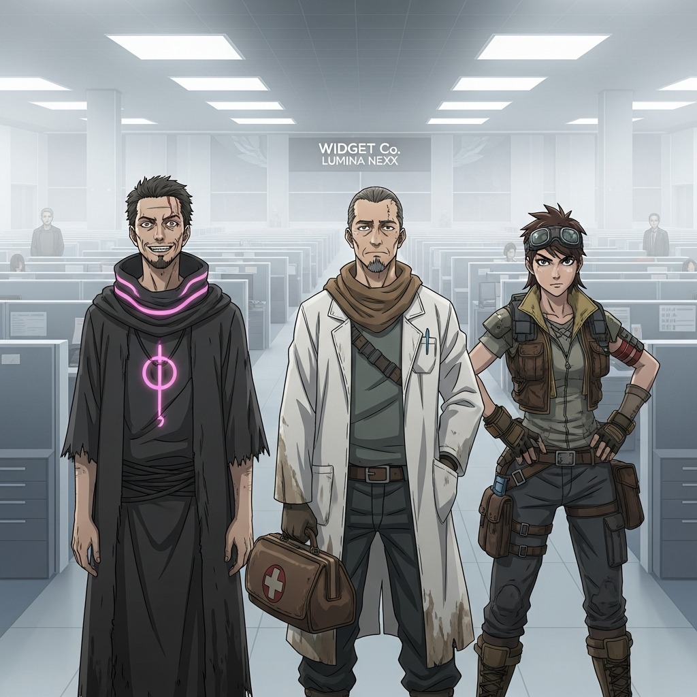
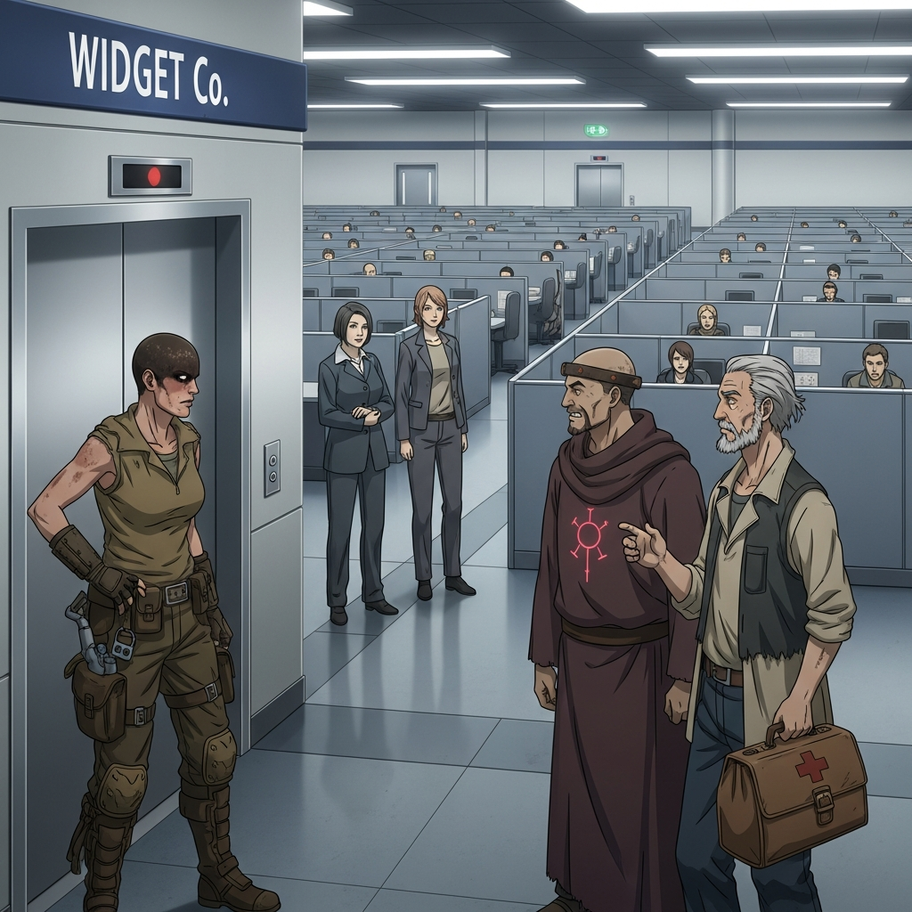
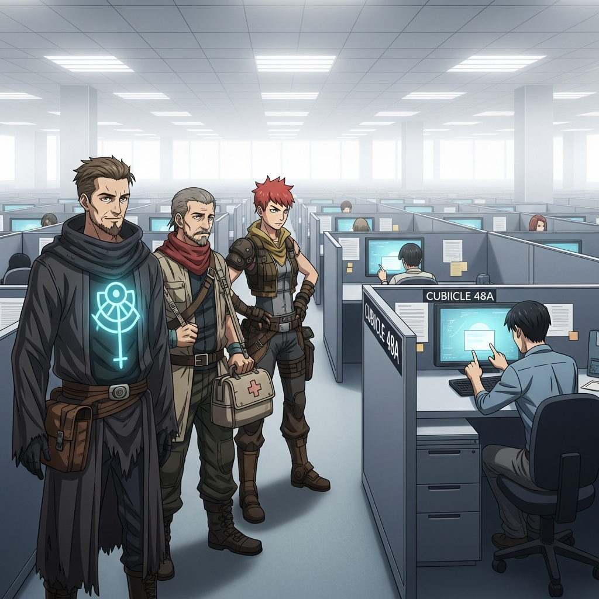
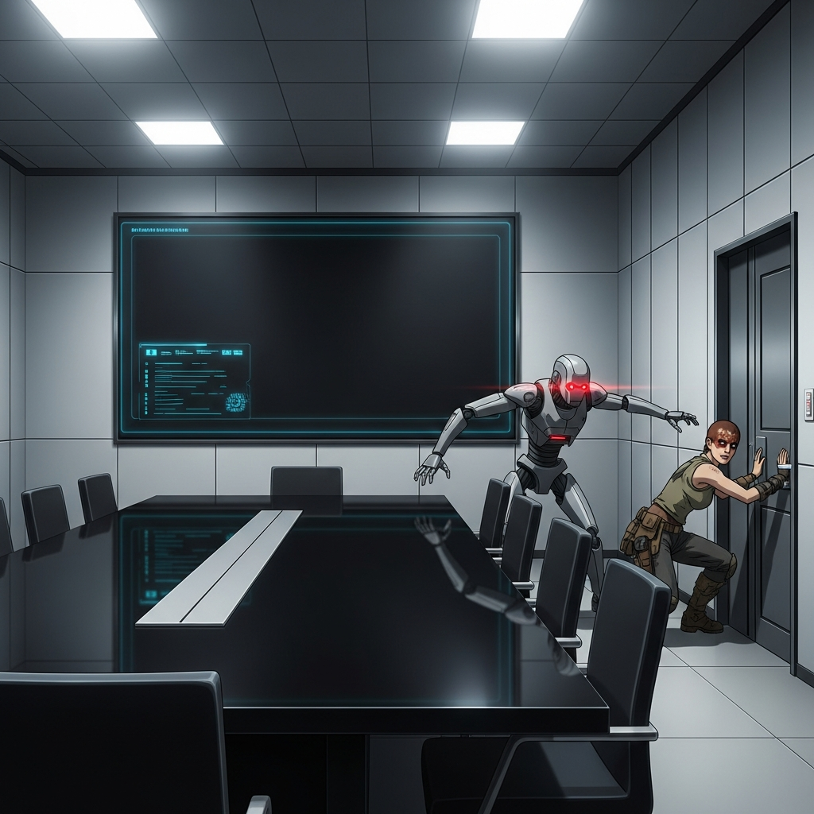

# D&D Campaign Timeline

*Generated: 2026-03-02 20:14:37*

## The Party

- **Preacher** — Human Cult Leader (Warlock) (Lvl 1) — 9/9 HP
- **Doc** — Human Scavenger Medic (Cleric) (Lvl 1) — 4/9 HP
- **Furiosa** — Human Wasteland Scout (Ranger) (Lvl 1) — 1/9 HP

## World Building

- **buildCampaignPremise:** In a world where the old ways collapsed, survivors cling to fragments of humanity amidst the irradiated dust. But some fragments are more insidious than others. You three—Preacher, a zealous cult leader wielding strange powers; Doc, a grizzled medic remembering a bygone era; and Furiosa, a fierce scout of the Dead Zone—find yourselves inexplicably drawn into the monolithic, steel-and-glass labyrinth known only as Widget Co.  Once a corporate giant, Widget Co now stands as an anachronistic fortress, humming with an unnatural, sterile order amidst the chaos of the outside world. Here, project managers, lawyers, and executives move with a bizarre, almost ritualistic precision, oblivious or uncaring of the wasteland beyond.  Why were you brought here? What secrets does Widget Co guard within its endless cubicle farms and executive suites? And what does it want with the remnants of humanity struggling outside its polished doors? Your quest begins as new hires, tasked with the most mundane of corporate duties, but the air thrums with an unsettling energy, promising a far more sinister purpose beneath the fluorescent lights. You are the square pegs in round holes, and Widget Co intends to make you fit... or break you trying.
- **buildLocationGraph:** The harsh, sterile glow of fluorescent lights bathes the room in an oppressive, unyielding brightness. This is the **Lumina Nexus**, a sprawling, open-plan office space at the heart of Widget Co. Rows upon rows of identical grey cubicles stretch into the hazy distance, each one a monument to corporate anonymity. The air, recycled and odorless, hums with the low thrum of unseen machinery and the rhythmic clicking of keyboards, punctuated by the hushed, almost reverent whispers of other "employees"—their faces unsettlingly placid.  Ahead, a monolithic, polished chrome elevator bank gleams, its doors occasionally sliding open to reveal deeper, equally sterile corridors. To your right, a glass-walled conference room, devoid of any natural light, offers a glimpse into what appears to be an endless meeting. Behind you, the heavy, reinforced blast doors you were ushered through stand as an intimidating barrier to the outside world. This is where your new "assignment" begins, amidst the baffling order of Widget Co.
- **buildNpcRegistry:** NpcRegistryResult(npcs=[NpcProfile(name=Ms. Thorne, role=Senior Project Manager, motivation=Maintain Widget Co's 'efficiency' and integrate new 'assets' into the corporate structure., currentLocation=Lumina Nexus, overseeing new hires), NpcProfile(name=Unit 734, role=Widget Co. Employee/Data Analyst, motivation=Process data, adhere to corporate protocols, and monitor for procedural deviations., currentLocation=Lumina Nexus, at a cubicle station)])
- **buildPlotHooks:** **1. The Efficiency Audits:** Your first task involves reviewing "resource allocation reports" and "employee performance metrics." At first glance, it's just mind-numbing data entry, but closer inspection reveals an unsettling pattern: these reports track not only internal Widget Co. assets but also resources from outside settlements—and the 'performance metrics' often correlate with sudden disappearances or reassignments of individuals who don't 'optimize' properly.  **2. The Ghost in the Machine:** While working on your assigned terminals, you might encounter a subtle anomaly: a corrupted file, a fleeting message across a screen that vanishes, or an old, unlisted memo detailing "Project Chimera" or "Phase 3 Integration." These fragments hint at Widget Co.'s true, horrifying purpose involving experimentation, assimilation, or a grand plan to reshape humanity itself.  **3. The Outsider's Plea:** A hushed whisper from a seemingly ordinary Widget Co. employee, a note slipped under your cubicle wall, or a brief, desperate plea for help projected onto a malfunctioning monitor reveals that not everyone here is a willing participant. Some are captives, working under duress, and they believe the party's arrival is a chance for freedom—or at least, a chance to expose Widget Co.'s dark agenda to the outside world.
- **commit:** World setup committed with 2 NPC(s) and 3 location node(s).

---

**ℹ️ Game Started:** 3 adventurers set out from Lumina Nexus.

### 🎭 Opening Scene

The harsh, sterile glow of fluorescent lights bathes the Lumina Nexus in an oppressive, unyielding brightness. This sprawling, open-plan office space at the heart of Widget Co. is filled with rows upon rows of identical grey cubicles stretching into the hazy distance, each one a monument to corporate anonymity. The air, recycled and odorless, hums with the low thrum of unseen machinery and the rhythmic clicking of keyboards, punctuated by the hushed, almost reverent whispers of other "employees"—their faces unsettlingly placid. Ahead, a monolithic, polished chrome elevator bank gleams, its doors occasionally sliding open to reveal deeper, equally sterile corridors. To your right, a glass-walled conference room, devoid of any natural light, offers a glimpse into what appears to be an endless meeting. Behind you, the heavy, reinforced blast doors you were ushered through stand as an intimidating barrier to the outside world. Ms. Thorne, a Senior Project Manager, hovers near the entrance, her gaze sharp and assessing. Further in, a diligent employee, Unit 734, taps away at a terminal, seemingly oblivious to anything beyond their screen. This is where your new "assignment" begins, amidst the baffling order of Widget Co.

---

## Round 1 — Lumina Nexus

🎲 **Preacher** — Charisma (Persuasion) check (DC 14)

#### ✅ Preacher

> **Action:** I move purposefully towards the gleaming Elevator Bank, my eyes scanning Ms. Thorne and Unit 734 for any reaction.

Preacher, a zealous glint in his eye, locked gazes with Unit 734. His voice, usually booming with apocalyptic fervor, dropped to a low, resonant hum, imbued with an almost imperceptible energy that prickled the sterile air. He didn't command; he *suggested*, weaving words of divine purpose and the inevitability of true revelation, a stark, unsettling contrast to the drone's corporate programming. Unit 734's rigid posture visibly faltered. For a split second, its dead, placid eyes flickered with a strange, almost human confusion, then rolled back with a soft, mechanical whir. The drone swayed, its hand twitching towards its head as if to clear an unheard static. A low, almost inaudible hum emanated from its core, and then, without a single word, Unit 734 slowly, robotically, stepped aside, its movements stiff and slightly off-kilter. The path to the gleaming elevator bank now stood clear. From a distance, Ms. Thorne narrowed her eyes, a flicker of cold, calculating interest replacing her usual placid control. This was no ordinary corporate interaction.

🎲 **Doc** — Wisdom (Perception) check (DC 14)

#### ✅ Doc

> **Action:** I move towards the Elevator Bank, keeping an eye on Ms. Thorne and Unit 734.

Doc arrived at the gleaming elevator bank, the silence here strangely amplified. His keen senses, honed by years in the wasteland, immediately picked up on a subtle tremor running through the thin partition of the cubicle nearest him. As his gaze sharpened, he saw it: from beneath the wall, a small, hastily scrawled note was slid into view, a desperate plea for recognition amidst the corporate void. He quickly snatched it, reading the shaky, urgent script: "They're watching. Project Chimera. Don't trust the reports." The stark message burned into his mind, a jarring discord in the Lumina Nexus's sterile symphony.

🎲 **Furiosa** — Wisdom (Perception) check (DC 16)

#### ❌ Furiosa

> **Action:** I move towards the Elevator Bank, my eyes scanning Ms. Thorne and Unit 734 for any tells.

Furiosa's sharp eyes darted between Ms. Thorne and Unit 734, but their expressions remained as meticulously neutral and devoid of any discernible tells as the polished chrome around them. Her wilderness instincts, usually so sharp, found no purchase in this sterile environment. Just as she approached the gleaming elevator bank, Ms. Thorne's voice, perfectly modulated and eerily devoid of warmth, echoed directly from a hidden speaker near Furiosa: "New hire, a moment. Your 'onboarding documents' require an additional biometric scan. Proceed to cubicle 47B for immediate processing." A faint, unsettling smile played on Ms. Thorne's lips, a gesture that seemed more like a glitch than genuine emotion.

### 📜 Round 1 Summary

Ms. Thorne’s placid mask finally cracks. Her voice, though still perfectly modulated by hidden speakers, takes on a razor-sharp edge. "This is not a suggestion, 'new hires'. Your 'performance metrics' depend on immediate 'compliance'. Unit 734, escort our new assets to Cubicle 47B. Ensure 'expediency'." With a soft, mechanical whir, Unit 734 detaches from its desk, its movements fluid and disturbingly precise as it glides towards the party, an unspoken threat in its metallic gaze.

---

## Round 2 — Lumina Nexus

🎲 **Preacher** — Wisdom (Perception) check (DC 16)

#### ✅ Preacher

> **Action:** I walk with Unit 734 towards Cubicle 47B, my gaze unwavering as I scan Ms. Thorne and the construct for any hidden tells.

As Preacher is ushered by the silent, metallic Unit 734 towards Cubicle 47B, his keen gaze locks onto Ms. Thorne. What was a mere flicker in her perfectly serene smile moments ago now sharpens into a chilling revelation. For a fraction of a second, the polished, human-like veneer of her face seems to ripple, revealing not flesh, but the glint of intricate circuitry or a cold, metallic sheen deep within her eyes. The illusion snaps back into place, leaving only the unsettling impression that Ms. Thorne is not entirely human, a high-functioning automaton, or something far more sinister. The memory of her glitching smile, now a shared experience, resonates with an eerie certainty.

🎲 **Doc** — Wisdom (Perception) check (DC 14)

#### ❌ Doc

> **Action:** I follow Preacher and Unit 734, scanning the cubicles for any hidden dangers.

As Doc trails Preacher and Unit 734, his gaze sweeps across the cubicle farm. The endless rows of identical workstations and the placid, focused faces of the Widget Co. employees blend into a monotonous blur. The low hum of machinery and the rhythmic clicking of keyboards create an almost hypnotic drone, making it difficult to discern any anomalies amidst the sterile order. He misses the subtle flicker of a data pad, the glimpse of unusual code lost in the corporate white noise as Unit 734 continues to guide him forward.

🎲 **Furiosa** — Wisdom (Perception) check (DC 14)

#### ✅ Furiosa

> **Action:** I follow Preacher and Unit 734 to Cubicle 47B, my eyes meticulously scanning every cubicle and employee as I move.

As Furiosa's keen scout eyes sweep the monotonous cubicle farm, her gaze catches on something amiss at Cubicle 48A, directly adjacent to their destination. An employee there, hunched over a terminal, subtly taps a sequence on a *separate*, unassigned data pad, before quickly flipping it shut and returning to their work with forced intensity. It's a fleeting, almost imperceptible gesture, but the desperate urgency behind it speaks volumes to Furiosa's instincts.

### 📜 Round 2 Summary

Just as Unit 734 gestures towards Cubicle 47B, a sudden, piercing klaxon blares through the Lumina Nexus. All the fluorescent lights flicker erratically, then dim to a pulsing, ominous red. Across dozens of cubicle screens, the Widget Co. logo distorts, replaced for a split second by a rapid-fire sequence of garbled code and an image of a monstrous, shadowy figure with glowing red eyes, before returning to a static hum. Panic ripples through the placid employees, some displaying visible distress.

---

## Round 3 — Lumina Nexus

🎲 **Preacher** — Constitution saving throw (DC 14)

#### ✅ Preacher

> **Action:** I place my hand upon the biometric scanner, but my gaze does not fall on the screen; instead, I project my will, seeking to pierce the machine's corrupted veil for whispers of its true purpose.

A surge of raw energy jolts through Preacher's arm as his hand touches the biometric scanner, attempting to lock his muscles into rigid paralysis. But Preacher, hardened by the wastes and imbued with strange resilience, resists the invasive command. With a defiant grunt, he wrenches his hand free, the scanner sparking as it loses its grip. Ms. Thorne's placid mask shatters completely, her voice rising above the blaring klaxon, "What have you done?!" 

Before Unit 734 can make a move, a cold, synthesized voice booms through the Nexus, overriding the alarm: "Security Protocol Omega initiated. All unassigned personnel to Executive Briefing Room Gamma for immediate re-evaluation." Unit 734's red eyes, which had flared with predatory intent, now fix on the party with an unnerving, directive glow. "Follow," it commands, gesturing towards a newly opened, reinforced door beside the Elevator Bank that was not visible before. The other employees, in a state of agitated, robotic compliance, shuffle towards the designated exit, and the party is swept along in the sudden, forced movement.

🎲 **Doc** — Intelligence (Investigation) check (DC 12)

#### ✅ Doc

> **Action:** I cautiously approach the blank holographic display screen, examining its surface for any hidden controls or indications of its purpose.

As the heavy door of Executive Briefing Room Gamma hissed shut, Doc's mind raced, replaying the chilling data he'd glimpsed on the cubicle screen just moments before the forced relocation. The words burned themselves into his memory: "Subject: Doc. Designation: Provisional Biometric Compliance Agent. Performance Metric: Suboptimal. Risk Assessment: Non-Compliant Tendencies Detected. Further Processing Required." The implied 30-second countdown now felt like a lead weight in his gut, especially in this sterile, inescapable chamber. He understands now: the 're-evaluation' isn't just an assessment; it's the 'further processing' itself, and Widget Co. has already deemed him non-compliant.

🎲 **Furiosa** — Dexterity (Acrobatics) check (DC 14)

#### ✅ Furiosa

> **Action:** I move towards the Heavy Security Door, subtly scanning for weaknesses.

As Unit 734 lunges, Furiosa twists with the agility of a desert jackal, a blur of motion. She expertly ducks under its metallic arm, her momentum carrying her past the droning construct and directly towards the Heavy Security Door. The robot's red eyes track her, but it is a step behind, unable to react quickly enough to her swift evasion.

### 📜 Round 3 Summary

Doc's nimble fingers dance across the holographic display. With a silent click, the massive screen flares to life, not with corporate data, but a chilling, crimson countdown:

---

## Round 4 — Executive Briefing Room Gamma

🎲 **Preacher** — Wisdom (Perception) check (DC 14)

#### ✅ Preacher

> **Action:** I stride towards the holographic display, my gaze piercing its crimson glow, and begin to decipher the revealed escape routes.

Preacher's perception cuts through the static, his gaze dissecting the flashing crimson data on the display. He discerns not just the primary exit points, but also a subtle, undocumented maintenance tunnel marked with a flickering glyph, leading away from the heavy door guarded by Unit 734. More disturbingly, he deciphers a sub-protocol labeled "Adaptive Re-evaluation - Phase 2: Neural Calibration" scheduled to begin in 30 seconds.

🎲 **Doc** — Dexterity saving throw (DC 14)

#### ✅ Doc

> **Action:** I move to the Heavy Security Door and inspect its surface for any controls or mechanisms.

As Doc, having seen the ominous countdown on the display, investigated the Heavy Security Door, his fingers brushed against a subtle seam. With a piercing whine, a violent discharge of static electricity erupted from the door's surface. But Doc, with a lightning-fast jerk, pulled his hand back just in time, the crackling energy arcing harmlessly inches from his skin. Though the danger was averted, the high-pitched alarm still screamed through the sterile chamber. Unit 734, its red eyes now burning with a focused intensity, pivoted sharply, its metallic frame tensing as it aimed its optical sensors directly at Doc, its posture shifting to one of immediate, aggressive threat.

🎲 **Furiosa** — Constitution saving throw (DC 13)

#### ❌ Furiosa

> **Action:** I move directly to the Heavy Security Door and begin meticulously inspecting the seam Doc found, searching for any hidden controls or release mechanisms.

The blaring alarm intensifies to an unbearable shriek as Furiosa attempts to brace herself. Unit 734, its attention briefly diverted, now emits a shrill, piercing frequency directly at her. The highly directional sonic pulse slams into Furiosa, disorienting her completely. She stumbles backward, a wave of nausea washing over her as the sterile room seems to spin. Before she can regain her footing, the heavy, armored footsteps from the Lumina Nexus entrance grow louder, echoing with an undeniable threat. More Widget Co. security is inbound, and Furiosa is exposed.

### 📜 Round 4 Summary

The sonic pulse leaves Furiosa dazed, collapsing to the sterile floor. The incoming footsteps swell into a metallic crescendo as two Widget Co. Security Bots, sleek and menacing, flank Unit 734. The holographic display, instead of showing an exit, now projects a chilling countdown: 'Neural Calibration Initiated: 00:00:59.' Ms. Thorne steps forward, her voice calm but devoid of mercy. 'It seems we've had enough 're-evaluation'. Time for re-alignment.' The Heavy Security Door, with Doc's subtle seam, glows momentarily before sealing itself completely, leaving no immediate escape.

---

## Round 5 — Executive Briefing Room Gamma

🎲 **Preacher** — Constitution saving throw (DC 13)

#### ✅ Preacher

> **Action:** I channel the whispers of the Void, focusing my arcane sight on the invisible energy field to pinpoint its source and simultaneously corrupt the 'Neural Calibration' data on the holographic display.

Preacher focuses, the strange energies within him resonating with the pulsing field, allowing him to subtly brace himself against the encroaching 'Neural Calibration'. While the field still thrums around him, he resists the immediate surge of pain and disorientation. The holographic display brightens, the countdown accelerating ominously, but Preacher's mind remains clear, searching for an exploitable flaw in Widget Co.'s assault. Ms. Thorne's smile falters slightly, seeing him resist, as Unit 734's whine escalates.

🎲 **Doc** — Constitution saving throw (DC 13)

#### ❌ Doc

> **Action:** I focus my senses on the walls, trying to pinpoint the exact source or a weak point in the invisible energy field.

The crimson beam from Unit 734 locks onto Doc, and the low hum intensifies into a piercing shriek within his skull. A searing wave of discordant data floods his mind, attempting to erase his will, overwrite his memories. He cries out, a guttural sound choked off as his body convulses against the invisible restraints. His vision blurs, the sterile room spinning, and he feels his consciousness flickering, pulled towards an abyss of corporate-mandated conformity. Ms. Thorne watches, a cruel smirk touching her lips. "One mind, re-aligned," she murmurs, her gaze now turning with keen interest towards Furiosa.

🎲 **Furiosa** — Wisdom (Perception) check (DC 16)

#### ❌ Furiosa

> **Action:** I meticulously observe the Heavy Security Door, Unit 734, Ms. Thorne, and the holographic display, searching for any changes or vulnerabilities, especially how Preacher's action affected the 'Neural Calibration' system.

As Doc's agonizing cries pierce the sterile air, Furiosa strains against the invisible field. Her senses, dulled by the sonic pulse and the encroaching mental static, fail to pinpoint the faint conduit beneath the floor panel. The pathway to chaos remains hidden, just out of reach. Ms. Thorne's cruel smirk widens, her eyes gleaming with predatory satisfaction as she observes Furiosa's struggle. "Another asset, ready for refinement," she purrs, and the crimson beam from Unit 734 shifts, now locking onto Furiosa. A new wave of discordant energy washes over her, attempting to scour away her defiance, to carve compliance into the very fabric of her being. The pressure intensifies, a silent scream building behind her eyes as Widget Co.'s will presses down.

### 📜 Round 5 Summary

Preacher, empowered by his resistance and fragmented lore, channels raw void energy directly into the holographic display, the hub of the 'Neural Calibration.' The system sputters, then flares violently, unleashing a feedback loop. Ms. Thorne screams as sparks shower from the ceiling, and Unit 734 seizes, its crimson eyes flickering erratically. The invisible energy field binding the party collapses, and a hidden emergency vent clangs open in the wall, spewing coolant. The Heavy Security Door hisses ajar, its lock overridden by the system chaos.

---

## Epilogue

The fluorescent nightmare of Widget Co. began with the mundane, lulling the disparate trio of Preacher, Doc, and Furiosa into a false sense of corporate assimilation. But beneath the layers of efficiency reports and biometric scans, a far more sinister truth pulsed. The party, initially seeking to understand their place, quickly found themselves unearthing whispers of 'Project Chimera' and the chilling reality of 'Neural Calibration'—Widget Co.'s horrifying plan to reshape humanity itself.

Trapped in Executive Briefing Room Gamma, subjected to the very 'processing' they sought to uncover, their individual strengths became their collective salvation. Preacher, the zealous cult leader, channeled the void's corrupting power not just to resist, but to weaponize, turning Widget Co.'s own system against itself. While Doc, despite his injuries, desperately sought an exit, and Furiosa, though battered and under mental assault, fought to maintain her defiant will. It was Preacher's audacious act, a surge of chaotic energy into the heart of the holographic display, that shattered the illusion of control.

The sterile chamber erupted into chaos. Sparks rained down, Unit 734 convulsed, and the oppressive energy field flickered and died. A hidden emergency vent clanged open, and the heavy security door, once a symbol of their inescapable fate, hissed ajar. With Widget Co.'s systems in meltdown, the party seized their chance, scrambling through the newly opened passages into the desperate, unpredictable freedom of the outside world. They had escaped, but the knowledge they carried—the grim reality of Widget Co.'s grand, horrifying agenda—was a burden far heavier than any corporate dossier.

### Character Fates

- ❤️ **Preacher** — After sabotaging Widget Co.'s Neural Calibration system and unleashing chaos, Preacher escaped the crumbling Executive Briefing Room Gamma. Empowered by the void and the knowledge gained, he becomes a symbol of resistance, travelling the Dead Zone and speaking out against the corporate monoliths that seek to consume humanity. His cult grows, not just in numbers, but in purpose, actively seeking out and disrupting other Widget Co. operations.
- ❤️ **Doc** — Though dazed and injured by Widget Co.'s assault, Doc found freedom amidst the system's collapse. His medical skills became more vital than ever on the outside, tending to the wounded and the psychologically scarred by the corporation's insidious reach. He carried a deep understanding of Widget Co.'s dark ambition, becoming a quiet but resolute voice warning others of the true threats to their minds and bodies.
- ❤️ **Furiosa** — Despite being stunned and mentally assailed, Furiosa's defiant spirit remained unbroken. Escaping the Executive Briefing Room Gamma, she returned to the wastes, her resolve hardened. Her scouting skills became invaluable in navigating new territories and establishing safe routes away from Widget Co.'s reach, helping her people find true haven and preparing them for the inevitable confrontation with the corporate leviathan.

*Themes: Resistance against corporate control, Uncovering sinister truths, The power of individual defiance, Hope in a dystopian world, Survival against overwhelming odds*

### What Comes Next...

*The escape from Widget Co. was just the beginning. The world beyond its polished doors is vast and dangerous, and now, the party carries not just their lives, but the terrifying truth of Widget Co.'s intentions. Will they expose the corporation to the remnants of humanity, or will they become its next 'optimized' assets? The neon glow of other corporate towers beckons from the horizon...*

---

## Final Status

- **Round:** 5/5
- **Location:** Executive Briefing Room Gamma
- **Quests:** Investigate the 'Efficiency Audits' for irregularities.; Discover the 'Outsider's Plea' – Investigate Project Chimera and the 'reports'.; Undergo Biometric Scan at Cubicle 47B.; Witnessed a covert data transfer/message at Cubicle 48A. Investigate the employee and their data pad.; Investigate the system malfunction and the cryptic image; identify the source of the "Ghost in the Machine."; Undergo re-evaluation at Executive Briefing Room Gamma.; Uncover the specifics of Widget Co.'s 'Processing' protocols. Escape the Executive Briefing Room Gamma before 'further processing' begins.; Investigate the Heavy Security Door for an exit or weakness.; Escape Executive Briefing Room Gamma before the 'Re-evaluation Protocol' completes.; Identify and utilize the hidden maintenance tunnel to escape 'Neural Calibration' protocol.; Evade the sonic pulse and confront or escape the incoming Widget Co. Security.; Resist Neural Calibration and find a way to escape your restraints.; Resist Neural Calibration and find a way to escape your restraints.; Endure and resist amplified Neural Calibration, even as your mind is assaulted.; Endure and resist amplified Neural Calibration, your mind under direct assault.; Escape Widget Co. from the Executive Briefing Room Gamma.

- **Preacher** (❤️ 9/9) — Liberated
- **Doc** (❤️ 4/9) — Dazed, but Free
- **Furiosa** (❤️ 1/9) — Stunned, but Free

