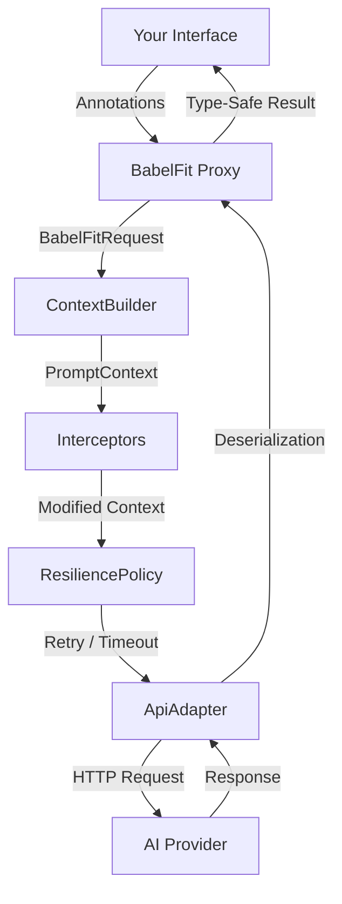

# BabelFit


A **type-safe, Retrofit-inspired AI client for Kotlin and Android.** Define an interface with annotations, and BabelFit generates a type-safe proxy client, translating unstructured LLM text into structured Kotlin objects — similar to how Retrofit bridges REST APIs.

```kotlin
interface QuestionAPI {
    @AiOperation(description = "Provide an in-depth answer to the question")
    suspend fun askQuestion(
        @AiParameter(description = "The question to be answered")
        question: String
    ): String
}

val instance = babelFit<QuestionAPI> {
    adapter(OpenAiAdapter())
}

val answer = instance.api.askQuestion("What is the meaning of life?")
```

## Features

- **Interface-driven**: define AI interactions as Kotlin interfaces
- **Kotlin DSL**: configure with `babelFit<T> { ... }` builder DSL
- **Coroutine support**: `suspend` functions work natively alongside `Future<T>`
- **Streaming**: return `Flow<String>` for token-by-token streaming responses
- **Annotation metadata**: describe operations, parameters, and response schemas for the AI
- **Adapter pattern**: swap AI providers without changing your interface (OpenAI included)
- **Multi-vendor routing**: route requests to different adapters per method (e.g., Anthropic for text, OpenAI for images)
- **Tool calling**: multi-turn LLM↔tool loops with pluggable `ToolProvider` abstraction
- **MCP support**: consume MCP server tools and expose BabelFit interfaces as MCP servers
- **Context control**: replace or intercept the prompt pipeline with `ContextBuilder` and `Interceptor`
- **Conversation history**: inject prior messages via `PromptContext.conversationHistory` for multi-turn conversations
- **Resilience**: retry with exponential backoff, per-call timeouts, result validation, and fallback adapters
- **Memory system**: persist results across calls with `@Memorize` for stateful conversations
- **Type-safe responses**: get deserialized Kotlin objects back, not raw strings
- **Agent patterns**: build multi-step and decision-making AI workflows with `babelfit-agents`
- **Test-first**: `babelfit-test` module with `MockAdapter`, `MockToolProvider`, test helpers, and prompt assertions

## Project Structure

BabelFit is organized into a core library, vendor adapters, extensions, and samples. See the individual READMEs for deep dives into specific features.

| Module | Description |
| -------- | ------------- |
| [`babelfit-core`](babelfit-java/core/README.md) | Core library: annotations, proxy, context pipeline, routing adapter, tool-calling abstractions, resilience. Zero AI-provider dependencies. |
| [`babelfit-openai`](babelfit-java/vendor/openai/README.md) | OpenAI adapter: sends `PromptContext` to OpenAI with native tool-calling support. |
| [`babelfit-gemini`](babelfit-java/vendor/gemini/README.md) | Google Gemini adapter: sends `PromptContext` to Gemini with native tool-calling support. |
| [`babelfit-claude`](babelfit-java/vendor/claude/README.md) | Anthropic Claude adapter: sends `PromptContext` to Claude with native tool-calling support. |
| [`babelfit-mcp`](babelfit-java/ext/mcp/README.md) | MCP integration: consume MCP server tools via `McpToolProvider`, expose BabelFit interfaces as MCP servers via `BabelFitMcpServer`. |
| [`babelfit-agents`](babelfit-java/ext/agents/README.md) | Agent abstractions: `AutonomousAgent`, `DecidingAgent`, `AgentDispatcher` for multi-step AI workflows. |
| [`babelfit-test`](babelfit-java/ext/test/README.md) | Test utilities: `MockAdapter`, `MockToolProvider`, prompt assertions, test fixtures, `babelFitTest<T>()` / `babelFitStub<T>()` helpers. |
| [`babelfit-debug`](babelfit-java/ext/debug/README.md) | Debug adapter: wraps any adapter and writes request/response markdown files for post-hoc inspection. |
| [`samples-dnd`](babelfit-java/samples/dnd/README.md) | Sample app: a text-based D&D adventure with the AI as Dungeon Master. |

## Installation

Clone and build from source:

```bash
git clone https://github.com/adamhammer/BabelFit.git
cd BabelFit/babelfit-java
./gradlew build
```

Then add the modules as dependencies in your project:

```groovy
dependencies {
    implementation project(':babelfit-core')
    implementation project(':babelfit-openai')   // or your own adapter
    implementation project(':babelfit-agents')   // optional: agent patterns
    testImplementation project(':babelfit-test')  // test utilities
}
```

All library modules include `maven-publish` configuration for local or remote publishing.

## Quick Start

### 1. Define your API interface

Methods can return `Future<T>` or use `suspend`:

```kotlin
interface QuestionAPI {
    @AiOperation(description = "Answer the question in depth")
    @AiResponse(description = "The answer", responseClass = Answer::class)
    suspend fun askStruct(
        @AiParameter(description = "The question and its context")
        question: Question
    ): Answer

    @AiOperation(description = "Answer the question as plain text")
    @Memorize("last-answer")
    fun askString(
        @AiParameter(description = "The question")
        question: String
    ): Future<String>
}
```

### 2. Define your data classes

```kotlin
@Serializable
@AiSchema(description = "Holds info about the question")
data class Question(
    @AiSchema(description = "The question to be asked")
    val question: String = "",
    @AiSchema(description = "Who is asking the question")
    val context: String = ""
)

@Serializable
@AiSchema(description = "Holds the answer to the question")
data class Answer(
    @AiSchema(description = "A deep answer to the question")
    val answer: String = ""
)
```

### 3. Build and use

```kotlin
// DSL style (recommended)
val instance = babelFit<QuestionAPI> {
    adapter(OpenAiAdapter())
    resilience {
        maxRetries = 2
        timeoutMs = 30_000
    }
}

val answer = instance.api.askStruct(Question("What is the meaning of life?", "A curious student"))

// Builder style (also supported)
val instance2 = BabelFitBuilder(QuestionAPI::class)
    .setAdapterDirect(OpenAiAdapter())
    .build()
```

## Architecture



1. You define an interface with methods representing AI operations
2. Annotations provide metadata about operations, parameters, and expected response schemas
3. `babelFit<T> { ... }` (or `BabelFitBuilder`) creates a JDK dynamic proxy implementing your interface
4. The proxy builds a `BabelFitRequest` and passes it to a `ContextBuilder`
5. The `ContextBuilder` assembles a `PromptContext` (system instructions + method invocation JSON)
6. `Interceptor`s modify the context in registration order (inject world state, filter memory, etc.)
7. The `ResiliencePolicy` handles retries, timeouts, validation, and fallback
8. The `ApiAdapter` sends the final context to the AI provider
9. Responses are deserialized into your specified types via `kotlinx.serialization`

## Case Study: Text D&D (`samples-dnd`)

The `samples-dnd` module is a complete text-based Dungeons & Dragons adventure showing BabelFit's advanced AI patterns. It uses the AI as both the Dungeon Master (DM) and the Player Characters (PCs), showing how to build complex, multi-agent, stateful AI applications.

**[Read the full D&D Case Study](BabelFit-Kotlin/samples/dnd/README.md)** to learn how it uses, and **[browse example game runs](https://github.com/ahammer/BabelFit/tree/main/BabelFit-Kotlin/samples/dnd/runs)** to see real session outputs:

- **BabelFit Agents** (`AutonomousAgent`) to simulate independent player decision-making.
- **Interceptors** (`WorldStateInterceptor`) to dynamically inject real-time game state into the AI's system instructions.
- **ResiliencePolicy** to enforce business logic on the AI's structured outputs (e.g., validating HP changes).
- **Memory** (`@Memorize`) to automatically persist the AI's intermediate thoughts across its multi-step turn.
- **Tool Calling** to give agents access to deterministic game data (e.g., inspecting inventory and skills).

## License

MIT: see [LICENSE](LICENSE) for details.
